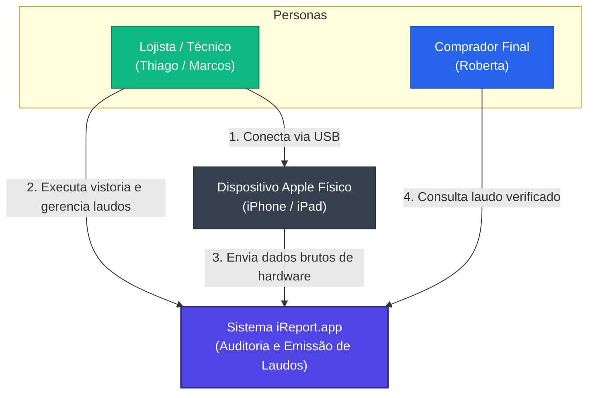
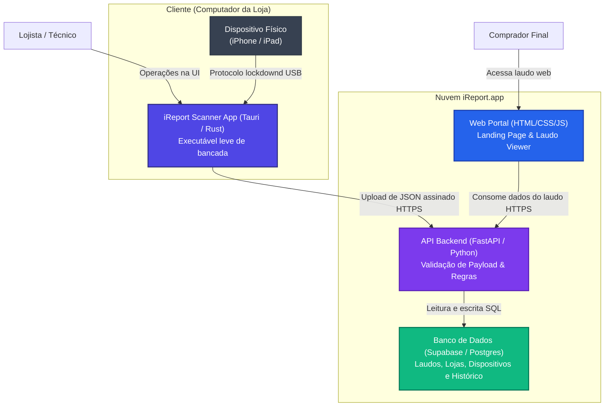

# Arquitetura de Software: C4 Model (iReport.app)

Este documento especifica a arquitetura da plataforma **iReport.app** utilizando a metodologia **C4 Model** (Nível 1 - Contexto do Sistema e Nível 2 - Containers).

---

## 1. Nível 1: Diagrama de Contexto (System Context)

O diagrama de contexto exibe o ecossistema do iReport.app em alto nível, mostrando como as personas e os sistemas externos (dispositivo físico da Apple) se relacionam com o nosso sistema.

### Detalhamento das Relações (Contexto)
1. **Lojista (Thiago/Marcos) ➔ Dispositivo Apple:** Conecta fisicamente o aparelho do cliente via cabo Lightning/USB-C no computador da loja.
2. **Lojista (Thiago/Marcos) ➔ iReport.app:** Opera o aplicativo desktop para comandar a vistoria e acompanhar o histórico de auditorias.
3. **Dispositivo Apple ➔ iReport.app:** Envia as assinaturas de hardware, serial da bateria, contagem de ciclos e status do iCloud via canal de diagnóstico USB.
4. **Comprador Final (Roberta) ➔ iReport.app:** Acessa a página pública de laudo verificada (via QR Code colado no aparelho ou link de anúncio) para checar o estado de originalidade antes de comprar.

---

## 2. Nível 2: Diagrama de Containers

Este nível detalha o interior do sistema da iReport.app, exibindo os containers de software (aplicações, bancos de dados, APIs) que compõem o produto e como eles conversam entre si.

### Detalhamento dos Containers

#### A) iReport Scanner App (Tauri / Rust / HTML / CSS)
* **Responsabilidade:** Rodar localmente no computador da assistência. É o responsável por monitorar as conexões USB, interagir com o daemon do iOS/iPadOS (`lockdownd`), extrair a árvore de propriedades do hardware (`ioreg`) e assinar criptograficamente o payload JSON gerado.
* **Tecnologias:** Tauri (Rust no backend de sistema, HTML5/CSS3/JS no frontend visual).
* **Protocolos:** USB (protocolo proprietário Apple de diagnóstico via `libimobiledevice`) e HTTPS (comunicação com a API).

#### B) Web Portal / Laudo Viewer (HTML / CSS / JS)
* **Responsabilidade:** Exibir a página de apresentação comercial do produto (Landing Page), formulários de inscrição e, principalmente, renderizar o **Laudo Cautelar Público** para compradores finais.
* **Tecnologias:** HTML5, CSS3 vanilla e JavaScript ES6. O laudo é renderizado do lado do cliente (*client-side rendering*) consumindo a API.
* **Protocolos:** HTTPS.

#### C) API Backend (FastAPI / Python)
* **Responsabilidade:** Centralizar as regras de negócio. Recebe a submissão de auditorias do App Desktop, valida a assinatura SHA-256 do payload (garantindo que o lojista não hackeou ou editou os dados), compara varreduras anteriores para alimentar o **Histórico Permanente**, gerencia contas e autoriza sessões de lojas parceiras.
* **Tecnologias:** Python com FastAPI (alta performance de processamento e concorrência assíncrona).
* **Protocolos:** HTTPS/REST e conexão de banco nativa (PostgreSQL Driver).

#### D) Banco de Dados (Supabase / PostgreSQL)
* **Responsabilidade:** Armazenar de forma persistente os dados de lojas, o histórico de componentes de cada dispositivo único (mapeado pelo IMEI/MLB) e os laudos gerados.
* **Tecnologias:** PostgreSQL (hospedado de forma gerenciada no Supabase).
