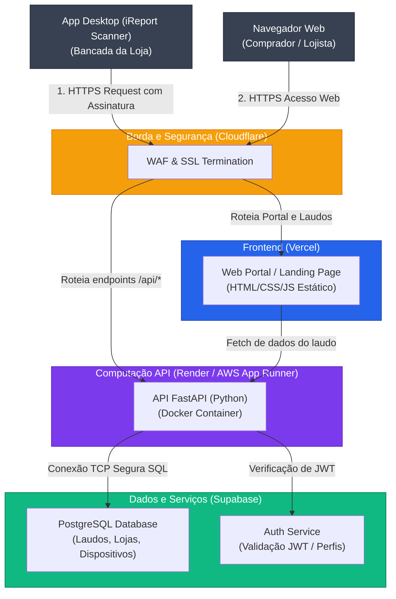

# Arquitetura em Nuvem: Infraestrutura e Roteamento (iReport.app)

Este documento especifica a topologia de infraestrutura em nuvem, provedores de hospedagem e o fluxo de tráfego seguro para a plataforma **iReport.app**.

---

## 1. Diagrama de Infraestrutura e Rede

O diagrama abaixo detalha como os serviços são distribuídos entre os diferentes provedores de nuvem (Vercel, Render/AWS e Supabase) protegidos pela camada de borda do Cloudflare.

---

## 2. Detalhamento dos Provedores e Escolhas Técnicas

A escolha dos provedores de nuvem foi feita pensando em **Custo Inicial Zero**, escalabilidade automática e facilidade de manutenção para uma equipe enxuta.

### A) Segurança e Borda: Cloudflare
* **Função:** Gerenciar o DNS, prover SSL/TLS automático, mitigar ataques DDoS e aplicar regras de WAF (Web Application Firewall) para bloquear bots que tentem escaneamentos massivos de laudos públicos.
* **Justificativa:** Plano gratuito extremamente robusto que blinda nossa API contra ataques mal-intencionados.

### B) Hospedagem Frontend: Vercel
* **Função:** Hospedar o portal institucional, formulários de lista de esperas B2B e o leitor dinâmico do Laudo Web (`ireport.app/laudo/[id]`).
* **Justificativa:** Deploy contínuo integrado ao GitHub, CDN global nativa (carregamento do laudo em milissegundos) e custos iniciais zerados (plano Hobby/Pro com generosos limites).

### C) Hospedagem Backend API: Render ou AWS App Runner
* **Função:** Hospedar a API FastAPI em Python empacotada em um container Docker.
* **Justificativa:** O Render oferece hospedagem simplificada de containers com SSL automático e deploy via Git. A API realiza operações leves (validação de assinatura SHA-256 e gravação de banco), demandando pouca memória RAM (containers de 512MB de RAM são suficientes para o MVP).

### D) Backend as a Service (BaaS): Supabase
O Supabase atua como nossa infraestrutura servidora de dados integrada:
1. **Banco de Dados (PostgreSQL):** Banco de dados relacional principal que suporta o diagrama de tabelas DDL modelado no PRD.
2. **Auth (GoTrue):** Resolve toda a autenticação de lojistas por JWT de forma segura e nativa, reduzindo o código necessário na API FastAPI.
