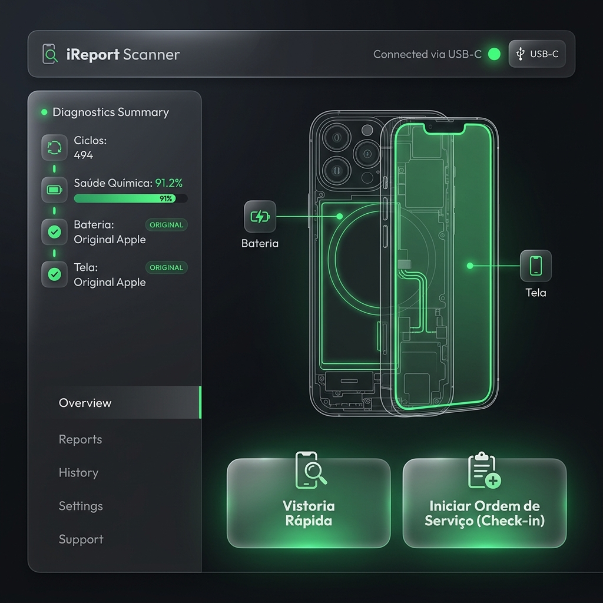
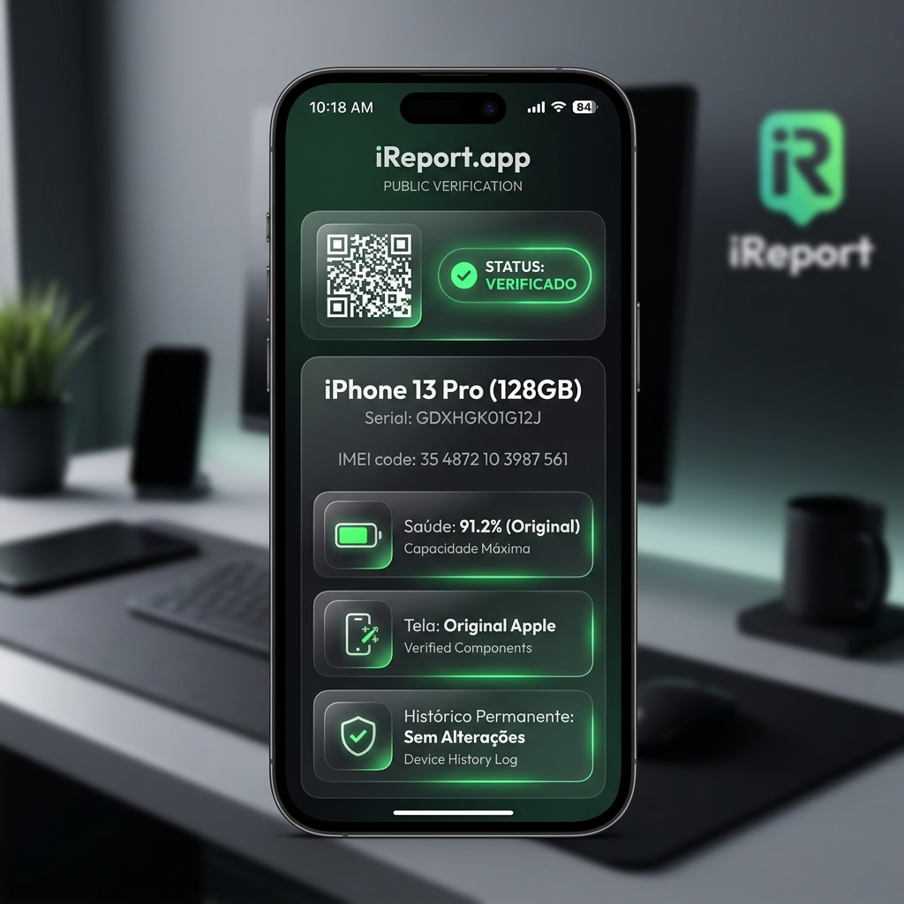

# Mockups Visuais e Design do Sistema (iReport)

Este documento centraliza as especificações de interface e o design visual (UIs) do ecossistema do **iReport**. As interfaces adotam uma identidade visual moderna baseada em **Glassmorphism**, fundo escuro fosco (dark mode) e tipografia limpa (Outfit).

---

## 1. Aplicativo Desktop (iReport Scanner)

Este é o executável leve de bancada em Tauri. O design foi projetado para ser intuitivo para o técnico, mostrando imediatamente o diagrama técnico do celular conectado via USB e os resultados do diagnóstico à esquerda. Os dois botões principais de ação física ("Vistoria Rápida" e "Ordem de Serviço") estão posicionados em destaque.

---

## 2. Portal Web / Página Pública (Laudo Verificado)

Esta é a página mobile-friendly que abre no navegador do comprador final ou cliente de assistência. Ela prioriza a leitura em smartphones, apresentando o badge verde de **"Status: Verificado"** na barra de topo e cartões limpos e brilhantes confirmando a saúde de bateria, originalidade de tela e o **Histórico Permanente (Sem Alterações)**.

